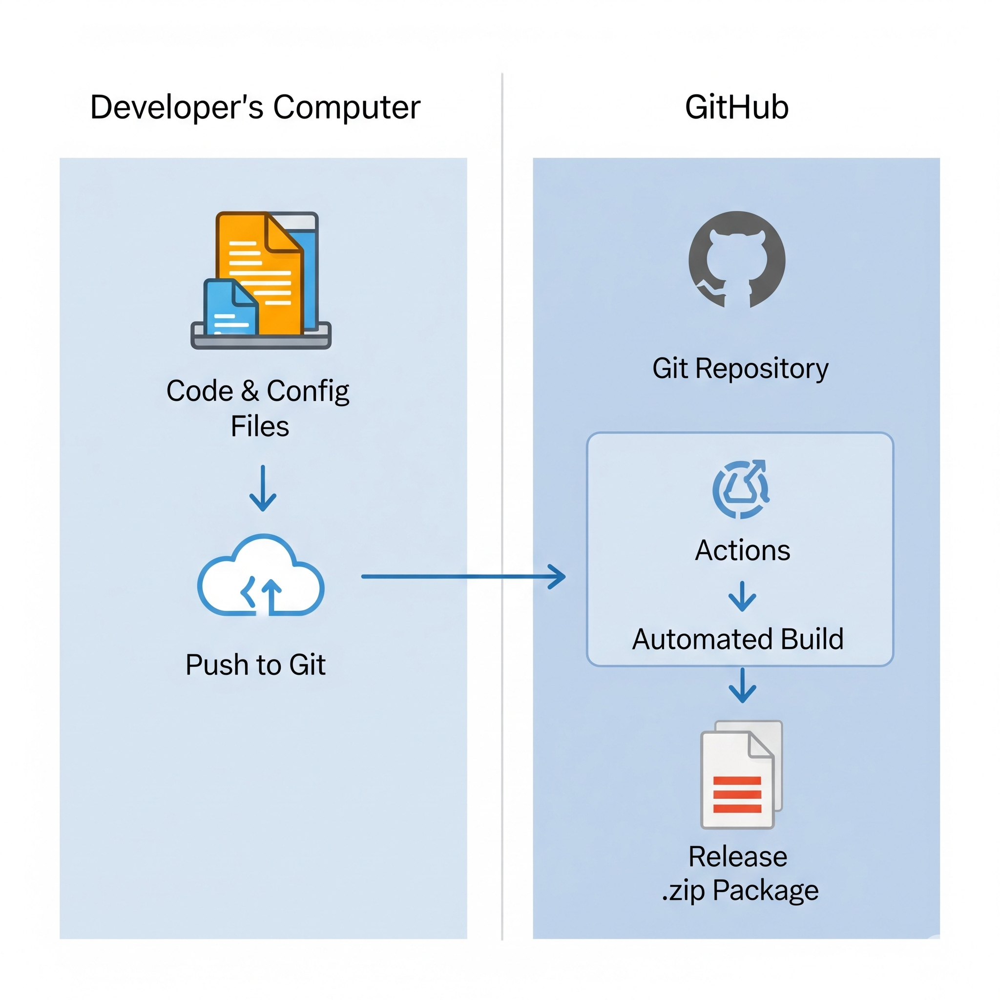
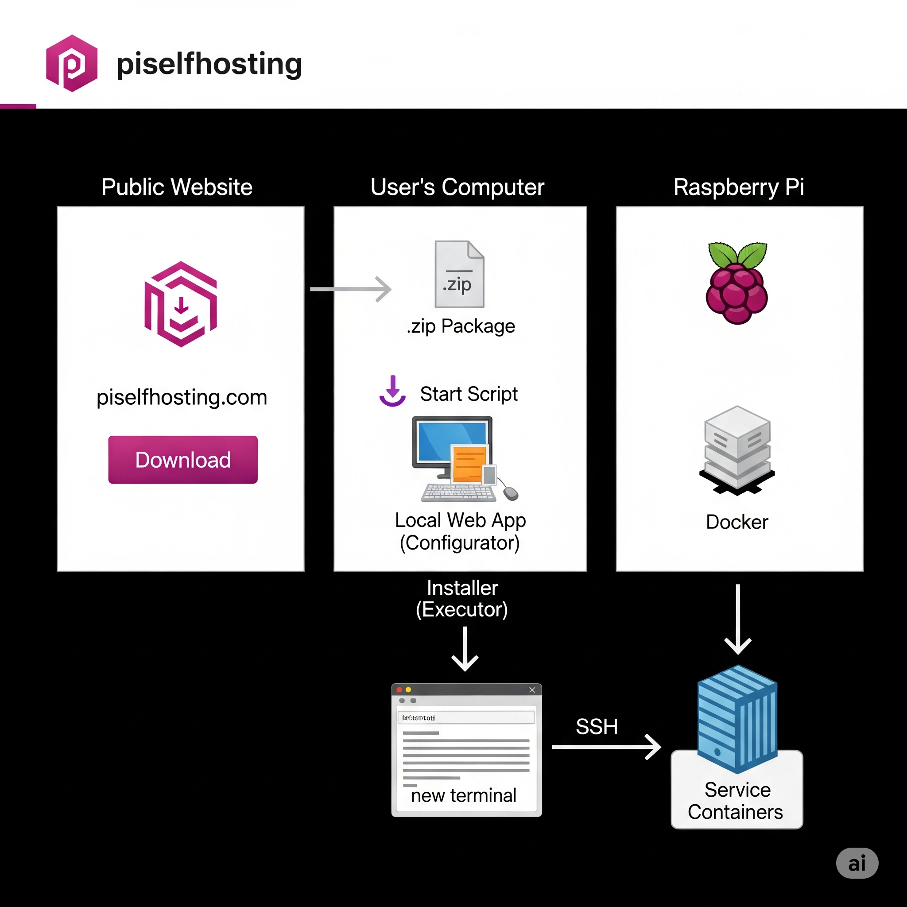

# PiSelfhosting

 

Welcome to PiSelfhosting! This project provides a user-friendly system to deploy and manage a suite of self-hosted services on a Raspberry Pi (or any Linux-based system) using Docker. Our goal is to make self-hosting powerful, accessible, and easy to maintain.

## 🌟 Key Features

* **User-Friendly GUI Installer**: A simple, local web application guides you through selecting and configuring components. No command-line expertise is needed to get started.
* **Modular & Flexible**: Choose only the services you want from a curated list of popular applications.
* **Dockerized & Isolated**: Every service runs in its own Docker container, making the system clean, secure, and easy to manage.
* **Secure by Design**: Your sensitive information (like passwords) is handled securely and is not stored in plain text in the main configuration files.
* **Automated Helper Tools**: Powerful command-line tools help with complex tasks like discovering cameras for Frigate or managing service configurations.

## 🏛️ How It Works

The project is split into two main workflows: the **Development & Build Cycle** (how the software is packaged) and the **User Deployment Cycle** (how you install it).

*You can embed the two diagrams you saved here for a great visual explanation.*





In short, a user downloads a single installer package from GitHub. This package runs a local web-based "Configurator" for component selection, which then launches a command-line "Executor" to perform the actual installation on the Raspberry Pi.

## 🚀 Quick Start Guide

Getting your self-hosted environment running is simple:

1.  **Visit our Website**: Go to `piselfhosting.com` to see the available components and learn more.
2.  **Download the Installer**: Use the download link on the website to get the latest installer package (`PiSelfhosting-Installer.zip`) from our GitHub Releases.
3.  **Unzip & Run**: Unzip the file on your main computer (Windows, Mac, or Linux) and run the `start` script (`start.bat` or `start.sh`).
4.  **Configure**: The `start` script will launch the **Configurator** in your web browser. Use this graphical interface to select the components you want to install and enter your server details (Pi's IP address, etc.).
5.  **Deploy**: After you confirm your selection, the **Executor** will launch in a new terminal window. It will connect to your Raspberry Pi and handle the entire installation automatically. You can follow the progress live in this terminal.

## 🧩 Supported Components

PiSelfhosting supports a curated list of popular and powerful self-hosted services. The installer allows you to select any combination of the following components.

| Component | Project Name | Description | Official Link |
|:---|:---|:---|:---|
| **Portainer** | `portainer` | A powerful management UI for Docker environments. | [portainer.io](https://www.portainer.io/) |
| **Dashy** | `dashy` | A highly customizable, open-source personal dashboard. | [dashy.to](https://dashy.to/) |
| **Heimdall** | `heimdall` | A simple and elegant application dashboard. | [heimdall.site](https://heimdall.site/) |
| **Homer** | `homer` | A dead simple, static homepage for your server. | [GitHub](https://github.com/bastienwirtz/homer) |
| **Organizr** | `organizr` | A full-featured server organizer with a tabbed interface. | [organizr.app](https://organizr.app/) |
| **Traefik** | `traefik` | A modern reverse proxy and load balancer. | [traefik.io](https://traefik.io/traefik/) |
| **Nginx Proxy Manager**| `nginx-proxy-manager`| User-friendly interface for managing Nginx proxy hosts and SSL certificates. | [nginxproxymanager.com](https://nginxproxymanager.com/) |
| **Pi-hole** | `pi-hole` | A network-wide ad blocker that acts as a DNS sinkhole. | [pi-hole.net](https://pi-hole.net/) |
| **AdGuard Home** | `adguard-home` | Network-wide ad & tracker blocking DNS server. An alternative to Pi-hole. | [GitHub](https://github.com/AdguardTeam/AdGuardHome) |
| **Unbound** | `unbound` | A validating, recursive, and caching DNS resolver for maximum privacy. | [nlnetlabs.nl](https://www.nlnetlabs.nl/projects/unbound/about/) |
| **Home Assistant** | `homeassistant` | Open source home automation that puts local control and privacy first. | [home-assistant.io](https://www.home-assistant.io/) |
| **Frigate** | `frigate` | NVR with real-time object detection for IP cameras. | [frigate.video](https://docs.frigate.video/) |
| **Zigbee2MQTT** | `zigbee2mqtt` | Bridge the gap between your Zigbee devices and your MQTT broker. | [zigbee2mqtt.io](https://www.zigbee2mqtt.io/) |
| **Scrypted** | `scrypted` | High-performance video integration platform for smart homes. | [scrypted.app](https://www.scrypted.app/) |
| **Nextcloud** | `nextcloud` | The self-hosted productivity platform that keeps you in control. | [nextcloud.com](https://nextcloud.com/) |
| **Jellyfin** | `jellyfin` | A Free Software Media System that puts you in control of your media. | [jellyfin.org](https://jellyfin.org/) |
| **Sonarr** | `sonarr` | Smart PVR for newsgroup and bittorrent users to manage and download TV shows. | [sonarr.tv](https://sonarr.tv/) |
| **Radarr** | `radarr` | A fork of Sonarr to work with movies. | [radarr.video](https://radarr.video/) |
| **qBittorrent** | `qbittorrent` | A lightweight and powerful BitTorrent client. | [qbittorrent.org](https://www.qbittorrent.org/) |
| **SABnzbd** | `sabnzbd` | The popular and easy-to-use Usenet download client. | [sabnzbd.org](https://sabnzbd.org/) |
| **Vaultwarden** | `vaultwarden` | Lightweight, self-hosted password manager compatible with Bitwarden clients. | [GitHub](https://github.com/dani-garcia/vaultwarden) |
| **UniFi Controller** | `unifi-controller` | Manage your UniFi networking devices from a central controller. | [ui.com/wi-fi](https://ui.com/wi-fi) |
| **Uptime Kuma** | `uptime-kuma` | A fancy, easy-to-use self-hosted monitoring tool. | [GitHub](https://github.com/louislam/uptime-kuma) |
| **Web Notepad** | `web-notepad` | Simple notepad to display the post-install summary. | [GitHub](https://github.com/pajikos/minimalist-web-notepad) |
| **Conduit** | `conduit` | A lightweight, next-generation Matrix homeserver, ideal for Raspberry Pi. | [conduit.rs](https://conduit.rs/) |


## 🔧 Component Specific Notes

After installation, some components require additional setup or have important considerations. Find the notes for your installed services below.

### Matrix (Conduit)
* **❗️ Domain Name Required**: For your Matrix server to communicate with other servers (federation), it **must** be accessible on the internet via a domain name (e.g., `matrix.yourdomain.com`).
* **Reverse Proxy**: You must configure your reverse proxy (like Traefik or Nginx Proxy Manager) to correctly route traffic to the Conduit container. This involves setting up specific `.well-known` files for server discovery.
* **Client**: Conduit is a backend server. To use it, you need to connect with a Matrix client like [Element](https://element.io/).

### Reverse Proxies (Traefik / Nginx Proxy Manager)
* **Choose One**: You should only run **one** reverse proxy at a time. Both Traefik and Nginx Proxy Manager need to use the standard web ports (80 and 443) to function, and only one service can use a port at a time.

### DNS Ad-Blockers (Pi-hole / AdGuard Home)
* **Router Configuration**: After installation, you must log in to your router and change its **LAN/DHCP DNS server** setting to the IP address of your Raspberry Pi. This will route all network traffic from your devices through the ad-blocker.
* **No other action is needed** for devices on your network to be protected once the router setting is changed.

### Jellyfin
* **Hardware Acceleration**: For the best performance on a Raspberry Pi, it is highly recommended to enable hardware acceleration. Edit the `docker-compose.yml` file and uncomment the `devices:` section that corresponds to your Pi model (Pi 4 vs Pi 5) before starting the service.
* **Media Libraries**: After starting Jellyfin, you will need to configure your media libraries inside the Jellyfin web UI. Point them to the correct paths inside the container (e.g., `/data/movies` and `/data/tvshows`).

## 🛠️ Using the Helper Tools

After installation, you can manage your services using the included helper tools. These are located in the `scripts/` directory and are designed to be run via their wrapper scripts.

For example, to configure cameras for Frigate, you would run:
```bash
bash scripts/run-frigate-config-tool.sh
```

## 🤝 Contributing

We welcome contributions! Whether you want to add a new service, fix a bug, or improve documentation, your help is appreciated. Please open an issue or submit a pull request on GitHub.

When contributing, especially when creating new helper tools, please adhere to the project's architectural principles.

### Adding a New Component
1.  Add the component's definition to `components_metadata.json`, including the `project_url`.
2.  Create its `docker-compose.template.yml` in the `templates/` directory.
3.  Ensure all secrets use Docker's native substitution (`${...}`) and structural variables use Jinja2 (`{{...}}`).
4.  If it requires a helper tool, follow the principles below.

### The "Stop-Modify-Start" Principle
This is a core principle for all helper tools that change the configuration of a running service.

> **Principle:** A tool that modifies a configuration file must programmatically **stop** the corresponding container, perform the **modification**, and then **start** the container again.

**Why is this important?**
* **Safety**: It prevents potential data corruption or race conditions, especially if the service uses a database file for configuration.
* **Reliability**: It guarantees that the service is in a known, stable state before and after the change.
* **User Experience**: It automates the required restart, creating a seamless, one-command action for the user. They don't have to remember to run a separate restart command.

The tool should get the container name and config paths from the central `.env` file to remain decoupled and robust.

## 📄 License

This project is open-source and available under the [MIT License](LICENSE).